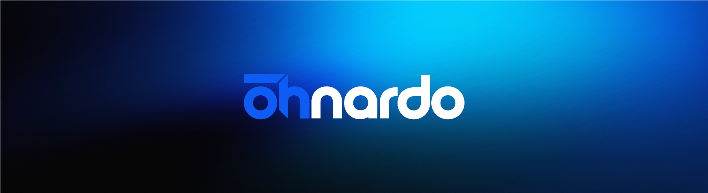

  

<h1 align="center">Leonardo Dariva</h1>

  <strong>Desenvolvedor Front-end & UI/UX Designer</strong>

  <a href="https://www.linkedin.com/in/leonardodariva/">LinkedIn</a>
  &nbsp;•&nbsp;
  <a href="https://leonardodariva.netlify.app/">Portfólio</a>
  &nbsp;•&nbsp;
  <a href="mailto:leodarivask@gmail.com">E-mail</a>

---

## Olá! 👋

Sou **Desenvolvedor Front-end e UI/UX Designer**, com experiência na criação de interfaces, produtos digitais e experiências para web.

Minha atuação conecta **design e desenvolvimento**, utilizando **HTML5, CSS3, JavaScript e React**, além de ferramentas como **Figma** e **Adobe XD** para criação de wireframes, protótipos e interfaces.

Tenho conhecimentos em **UI Design, UX Design, Product Design, Design Thinking, Lean UX, responsividade, acessibilidade, Git e GitHub**, buscando desenvolver soluções funcionais, intuitivas e alinhadas às necessidades dos usuários e dos negócios.

Minha trajetória profissional combina **tecnologia, design e comunicação**, com foco na evolução contínua das minhas habilidades e na aplicação de boas práticas no desenvolvimento de produtos digitais.

## Tecnologias e ferramentas

  
  
  
  
  
  
  
  

## Sobre mim

💬 Gosto de trabalhar na interseção entre **design e tecnologia**, transformando ideias e necessidades em experiências digitais claras, intuitivas e funcionais.

🚀 Atualmente, continuo aprimorando meus conhecimentos em **desenvolvimento Front-end, React, UI/UX e Product Design**.

<h2>
  📫 Entre em contato:
  
  |
  
  |
  
</h2>
